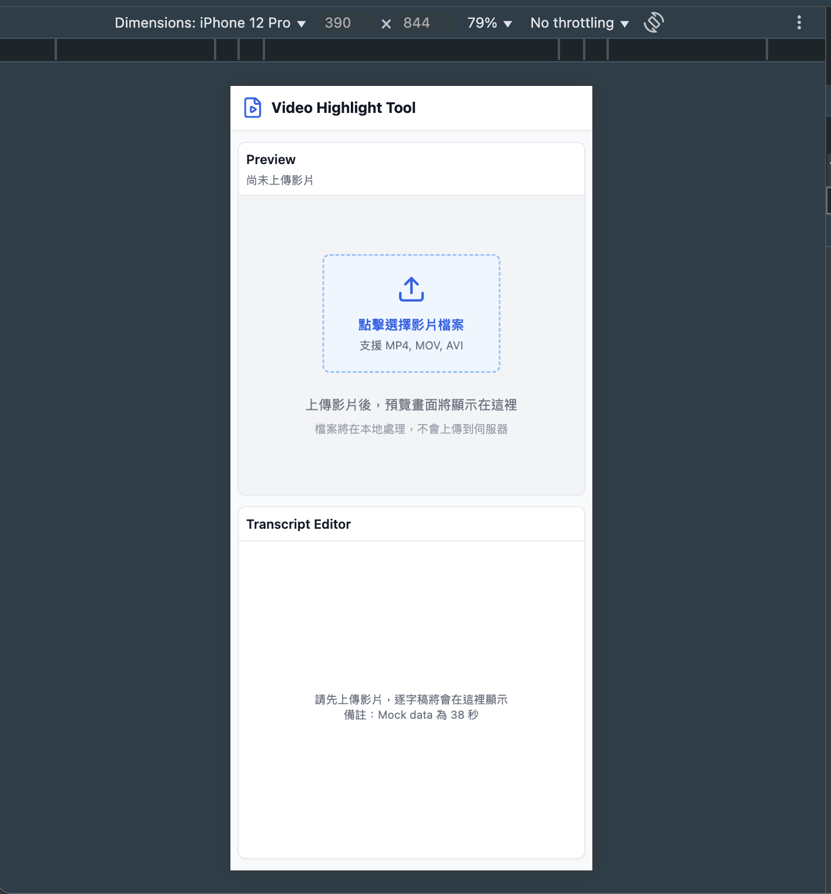
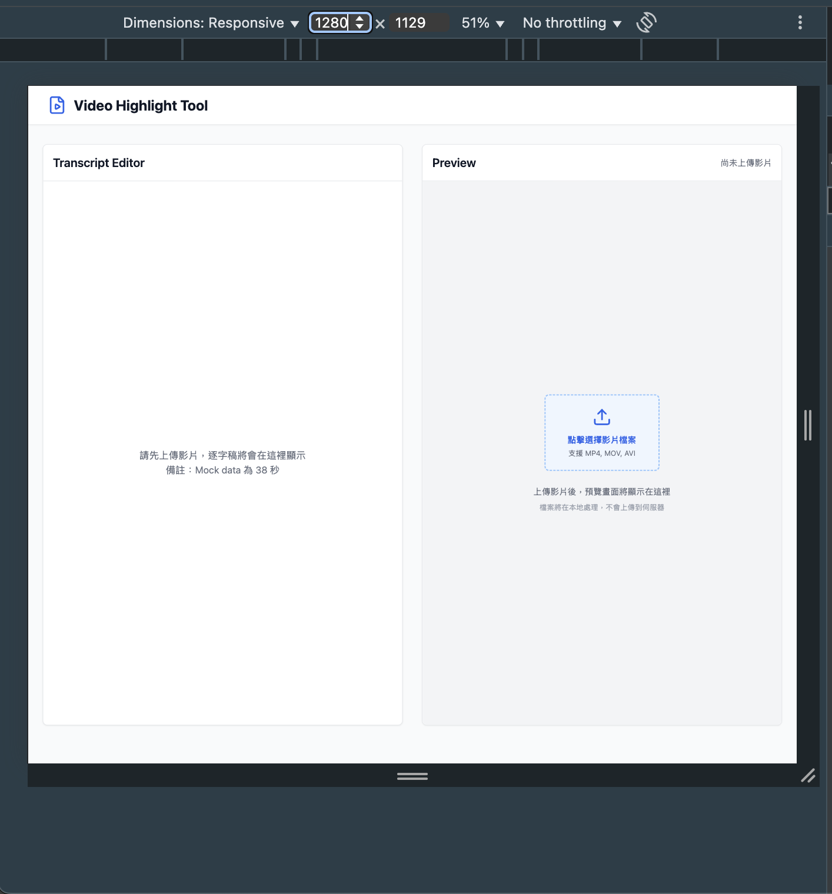
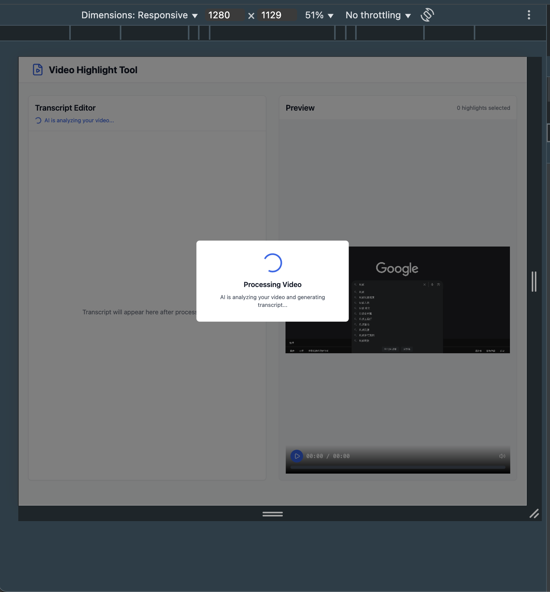
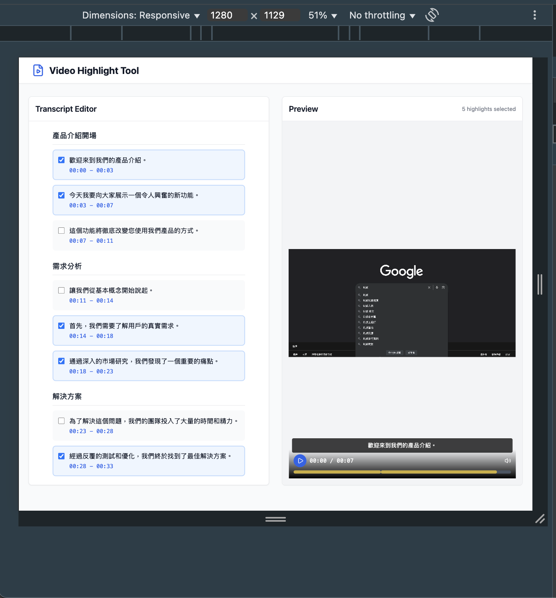

# 影片亮點編輯工具

一個現代化的網頁應用程式，具備 AI 驅動的轉錄生成和編輯功能，用於創建影片亮點片段。

## 專案概述

此工具允許使用者上傳影片、使用模擬 AI 處理生成轉錄文稿，並通過選擇特定句子來創建亮點片段。應用程式採用分割螢幕介面，在轉錄編輯器和影片預覽之間實現即時同步。

## 主要功能

### 影片上傳
- 支援拖拉放置或點擊上傳
- 相容常見影片格式（MP4、MOV、AVI）
- 本地檔案處理，無需上傳到伺服器

### 模擬 AI 處理
- 模擬轉錄生成，處理時間 2 秒
- 返回結構化資料：完整轉錄文稿、分段內容、段落標題、建議亮點句子

### 分割螢幕介面

**左側編輯器**
- 轉錄文稿按段落顯示
- 可選擇/取消選擇句子作為亮點
- 點擊時間戳跳轉到對應影片時刻
- 自動跟隨影片播放並高亮當前句子

**右側預覽**
- HTML5 影片播放器配備自訂控制項
- 文字覆蓋層顯示選中的轉錄內容
- 時間軸標示選中的亮點片段
- 可點擊時間軸進行快速導航

### 即時同步
- 編輯器與預覽面板雙向同步
- 選擇更新立即反映在預覽中
- 播放時自動滾動至當前句子

## 技術實現

### 技術棧
- **前端框架**: React 18 + TypeScript
- **建構工具**: Vite
- **樣式框架**: Tailwind CSS
- **圖示庫**: Lucide React

### 核心特色
- 組件化架構設計
- 完整 TypeScript 類型支援
- 響應式設計，支援桌面和行動裝置
- 本地處理，無需後端服務

## 快速開始

### 系統需求
- Node.js 16+ ( node 18)
- npm 

### 安裝步驟

1. **安裝依賴套件**
   ```
   npm install
   ```

2. **啟動開發伺服器**
   ```
   npm run dev
   ```

3. **開啟瀏覽器**
   前往 `http://localhost:5173`

## 使用方法

1. 上傳影片檔案
2. 等待 AI 處理完成（約 2 秒）
3. 在左側編輯器中選擇要保留的句子
4. 右側預覽面板即時顯示編輯結果
5. 點擊時間戳或時間軸進行導航

## 瀏覽器支援

- **桌面版**: Windows/macOS 上的 Chrome 最新版
- **行動版**: iOS Safari、Android Chrome 最新版

## 專案結構

```
src/
├── types/
│   └── index.ts              # 所有 TypeScript 接口定義
├── services/
│   └── mockAIService.ts      # AI 服務模擬 API
├── utils/
│   └── formatTime.ts         # 時間格式化工具函數
├── components/
│   ├── Header.tsx            # 頁面標題組件
│   ├── FileUpload.tsx        # 文件上傳組件
│   ├── ProcessingOverlay.tsx # 處理中遮罩組件
│   ├── Sentence.tsx          # 單句組件
│   ├── TranscriptSection.tsx # 逐字稿區段組件
│   ├── TranscriptEditor.tsx  # 逐字稿編輯器組件
│   ├── VideoControls.tsx     # 影片控制器組件
│   ├── VideoPlayer.tsx       # 影片播放器組件
│   └── PreviewPanel.tsx      # 預覽面板組件
└── App.tsx                   # 主應用程式
```

## 設計考量

- **使用者體驗**: 分割螢幕設計，清楚的視覺回饋
- **響應式設計**: 桌機並排佈局，行動裝置垂直堆疊

## Demo

### 手機尺寸


### 電腦尺寸


### 電腦尺寸（上傳中...）


### 電腦尺寸（上傳完成...）
